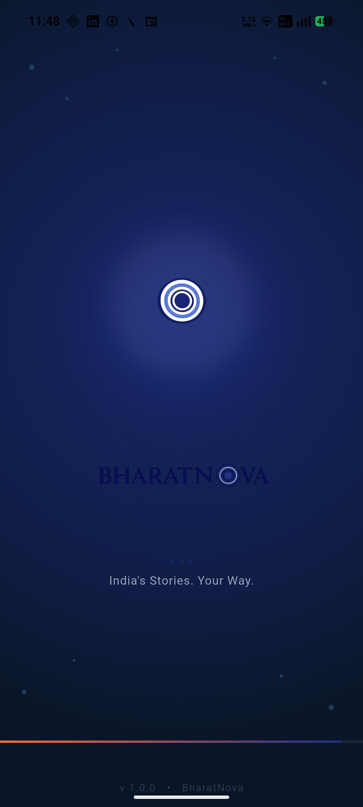
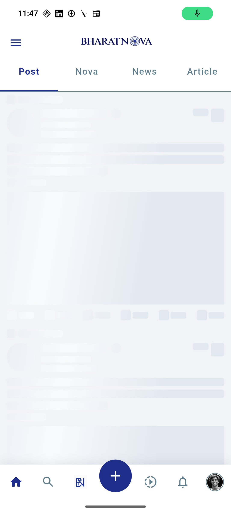
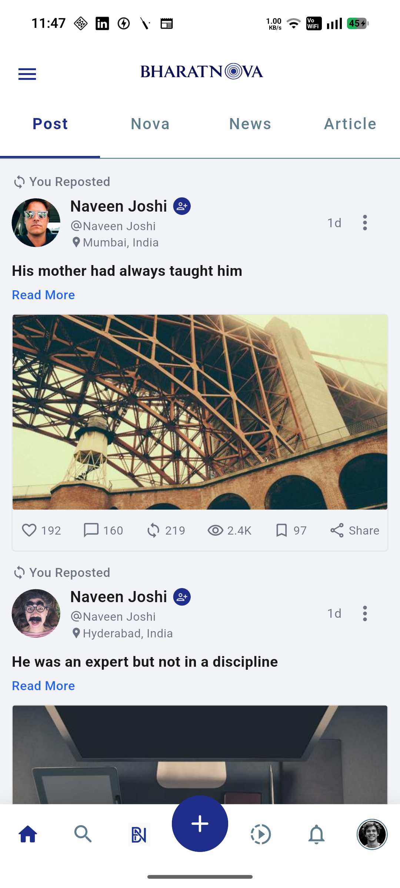

# BharatNova

A modern Indian social news feed app built with Flutter — clean architecture, smooth animations, and a native-feel UI.

---

## Features

- Animated splash screen with pulsing rings and staggered logo/text reveal
- Tab-based feed (Post · Nova · News · Article) with full-width indicator
- Post cards with image carousel, read-more toggle, and action bar
- Scroll-aware bottom nav bar (hides on scroll down, reveals on scroll up)
- Custom floating-action bottom navigation with BN logo item and center FAB
- Location-aware app bar
- Shimmer loading skeleton matching the post card layout
- Infinite scroll with pagination and pull-to-refresh
- On app launch, requests:
  - Location permission
  - Notification permission

---

## Architecture

Clean Architecture with feature-first folder structure.

```text
lib/
├── core/
│   ├── constants/        # AppColors, AppStrings, AppEndpoints
│   ├── di/               # GetIt service locator
│   ├── errors/           # Failure types
│   ├── network/          # Dio API client
│   ├── router/           # go_router named routes
│   └── widgets/          # AppBar, BottomNav, ShimmerCard
│
└── features/
    ├── splash/           # Splash screen
    ├── home/             # Shell page + nav
    ├── feed/             # Posts feed (BLoC)
    └── location/         # Device location (BLoC)


## Tech Stack

| Layer | Library |
|---|---|
| State management | flutter_bloc |
| Navigation | go_router |
| Dependency injection | get_it |
| HTTP | dio |
| Image caching | cached_network_image |
| Location | geolocator |

---

## Getting Started

```bash
git clone https://github.com/<your-username>/bharat_nova.git
cd bharat_nova
flutter pub get
flutter run
```

---

## Requirements

- Flutter 3.x
- Dart 3.x

---

## API

Posts are fetched from:

- DummyJSON → https://dummyjson.com/posts
- Picsum Photos → https://picsum.photos

with dynamically generated images via Picsum Photos.

## Screenshots

### Splash Screen



---

### Shimmer Loading Screen



---

### Home Screens

| Home Screen 1 | Home Screen 2 (When scrolling down, App bar disappears)|
|---|---|
|  |  |

